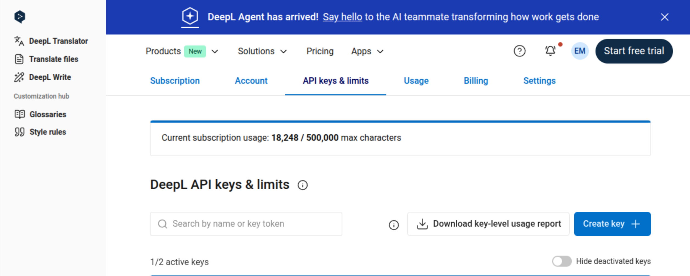
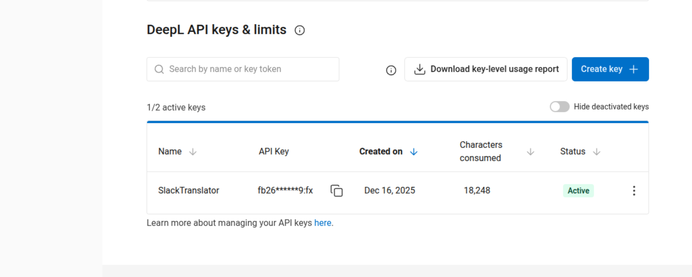

# Slack Translator 🌐

A Chrome extension that automatically translates Slack messages in real-time using DeepL's high-quality translation API.

## Features

- **Real-time Translation**: Automatically translates incoming and outgoing messages in Slack
- **DeepL Integration**: Uses DeepL API for high-quality, natural translations
- **Bilingual Interface**: UI available in English and Japanese with automatic detection
- **Formality Control**: Adjust the tone of translations (formal, informal, or default)
- **Translation Preview**: See translations before sending outgoing messages

### Formality Examples

The formality setting controls the tone of your translations, making them more appropriate for different contexts:

**English Input**: "What do you think we should do about this problem?"

**Formal Japanese** (prefer formal):
```
この問題についてどうすべきだと思いますか？
```

**Informal Japanese** (prefer informal):
```
この問題に対してどうすべきだと思う？
```

Formality is supported for: German, French, Italian, Spanish, Dutch, Polish, Portuguese, Japanese, and Russian.

## Installation

### From Source (Development)

1. Clone this repository:
   ```bash
   git clone https://github.com/EmilOJ/slack-translator.git
   cd slack-translator
   ```

2. Open Chrome and navigate to `chrome://extensions/`

3. Enable "Developer mode" (toggle in the top-right corner)

4. Click "Load unpacked"

5. Select the `slack-translator` directory

6. The extension icon should appear in your Chrome toolbar!

## Setup

### Getting a DeepL API Key

To use this extension, you need a DeepL API key:

1. Go to [https://www.deepl.com/en/your-account/keys](https://www.deepl.com/en/your-account/keys)

2. Create a DeepL account if you don't have one (free tier available)

3. Create a new API key:

   

4. Copy your API key:

   

5. Click the extension icon in Chrome and paste your API key in the settings

6. Configure your language preferences and formality settings

**Note**: DeepL offers a free tier with 500,000 characters/month. Free API keys end with `:fx`.
